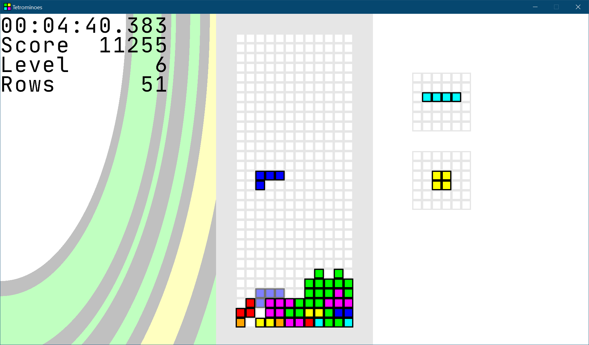

# Tetrominoes

## Description
`tetrominoes` is a clone of [Tetris][] built with [.NET Core][] and [MonoGame][].

[Tetris]: https://en.wikipedia.org/wiki/Tetris
[.NET Core]: https://dot.net
[MonoGame]: http://www.monogame.net

## Getting Started
### Requirements
* [.NET Core 3.1 SDK][]

[.NET Core 3.1 SDK]: https://dot.net

### Installation
1. Navigate to the [Latest Release][]
2. Download `OpenGL.zip`
3. Extract the archive to any location on your computer
4. Run `Tetrominoes.OpenGL.exe`
    - On Linux and MacOS platforms run `dotnet Tetrominoes.OpenGL.exe`

[Latest Release]: https://github.com/joncloud/tetrominoes/releases

### Keyboard Controls
* Movement - `W` `A` `S` `D`
* Rotate - `J` `L`
* Drop - `K`
* Swap - `I`
* Pause - `Spacebar`

### Gamepad Controls
The Gamepad Controls are setup using MonoGame, and default to the Xbox Controller layout. It also defaults to using controller #1.
* Movement - `DPad`
* Rotate - `A` `B`
* Drop - `Left Shoulder`
* Swap - `Right Shoulder`
* Pause - `Start`

### Configuration
Configuration is managed through `config.toml`, which is included in the release. Most options can be configured through the Options menu in game.

## Licensing
Released under the MIT License. See the [LICENSE][] File for further details.

[license]: LICENSE.md
